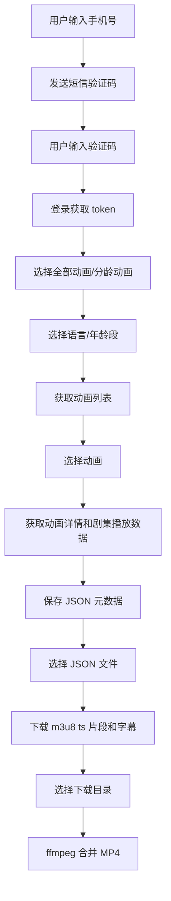
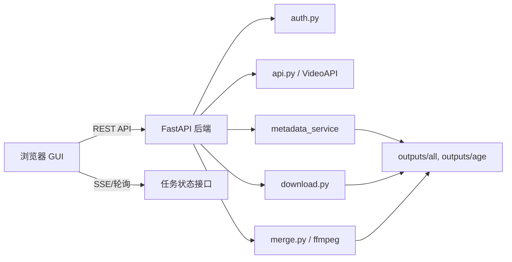
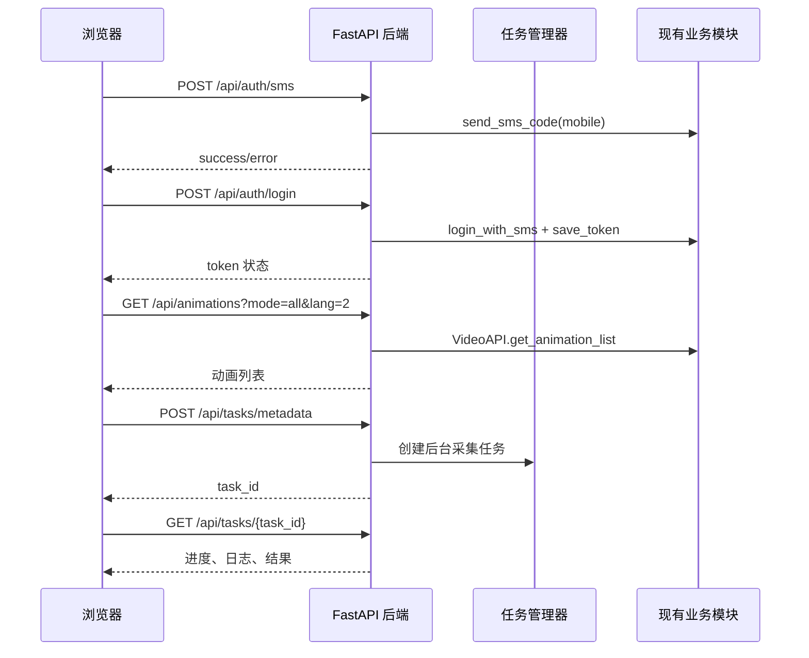

# ukids GUI 技术方案

## 1. 项目代码现状分析

当前项目是一个命令行版 `ukids` 视频资源下载工具，核心流程分为三段：

1. **认证登录**：手机号发送短信验证码，验证码登录并保存 `token.txt`。
2. **元数据采集**：获取动画列表、分龄列表、季/剧集信息、播放地址和字幕地址，并保存为 JSON。
3. **资源处理**：根据 JSON 下载 m3u8 的 ts 片段和字幕，再通过 ffmpeg 合并为 MP4。

### 1.1 文件职责

| 文件 | 当前职责 | GUI 改造价值 |
|---|---|---|
| `config.py` | API 基础地址、通用请求头、语言映射、Token 文件路径 | 保留，作为后端配置入口 |
| `auth.py` | 短信验证码发送、验证码登录、Token 保存/读取、交互式认证 | 拆分为可被 HTTP API 调用的认证服务 |
| `api.py` | `VideoAPI` 客户端，封装动画列表、分龄列表、动画详情、剧集、播放数据接口 | 可直接复用为 GUI 后端业务核心 |
| `main.py` | 命令行交互式元数据采集、选择动画、保存 JSON、失败记录 | 抽取纯业务函数，去掉 `input/print` 依赖 |
| `download.py` | m3u8 解析、ts 并发下载、字幕下载、下载统计 | 可复用下载函数，但需要增加进度回调/任务状态 |
| `merge.py` | 检查 ffmpeg、扫描下载目录、合并 ts 为 MP4 | 可复用合并逻辑，但需要增加进度回调/任务状态 |
| `README.md` | 命令行使用说明 | GUI 完成后补充 GUI 使用说明 |
| `docs/` | 已抓包/API 文档 | 可作为后端接口参数校验依据 |

### 1.2 当前业务链路



### 1.3 当前代码的 GUI 改造难点

- **大量交互依赖 `input()`**：`main.py`、`download.py`、`merge.py` 都以终端输入为主，不适合直接接入 Web。
- **进度通过 `print()` 输出**：GUI 需要结构化进度，例如任务状态、百分比、成功数、失败数、当前处理项。
- **长任务阻塞**：元数据采集、下载和合并都可能耗时较长，不能在 HTTP 请求中同步阻塞。
- **任务取消/重试缺失**：GUI 应提供任务取消、失败重试、跳过已完成等能力。
- **文件扫描逻辑分散**：JSON、季目录、剧集目录扫描分别在不同脚本中，需要统一为后端接口。

## 2. 推荐 GUI 形态

推荐使用：

- **前端**：原生 HTML + CSS + JavaScript，单页应用，低依赖、容易部署。
- **后端**：Python FastAPI，负责调用现有业务模块、管理任务、提供 REST API 和 SSE 进度推送。
- **任务执行**：后端使用线程池执行长任务，前端轮询或 SSE 查看任务进度。
- **本地运行**：用户启动 `python gui_server.py` 后访问 `http://127.0.0.1:8000`。

> 如果希望依赖更少，也可以用 Flask；但本项目包含长任务、状态 API、SSE/异步接口，FastAPI 更适合。

## 3. 总体架构设计



### 3.1 后端分层

建议新增以下文件，不破坏现有 CLI：

```text
ukids/
├── gui_server.py             # FastAPI 入口，静态页面托管 + API 路由
├── gui_services/
│   ├── __init__.py
│   ├── task_manager.py       # 后台任务、状态、日志、取消标记
│   ├── metadata_service.py   # 元数据采集业务，从 main.py 抽取
│   ├── file_service.py       # JSON/下载目录/MP4 文件扫描
│   └── schemas.py            # 请求/响应数据结构，可选
└── web/
    ├── index.html            # GUI 页面
    ├── app.js                # 前端逻辑
    └── style.css             # 页面样式
```

### 3.2 不建议直接改造方式

不建议在 GUI 后端中通过 `subprocess` 调用：

```bash
python main.py
python download.py
python merge.py
```

原因：

- 难以自动填写 `input()`。
- 难以获取结构化进度。
- 出错时只能解析终端文本，不稳定。
- 任务取消和重试困难。

更推荐把命令行脚本里的业务函数抽出来复用。

## 4. GUI 功能规划

### 4.1 页面结构

单页 GUI 建议分为 5 个区域：

1. **登录区**
   - 显示 Token 状态。
   - 输入手机号，发送验证码。
   - 输入验证码，登录并保存 Token。
   - 支持手动粘贴 Token。

2. **资源选择区**
   - 选择模式：全部动画 / 分龄动画。
   - 选择语言：英文 / 中文 / 全部。
   - 分龄模式下选择年龄段。
   - 点击加载动画列表。
   - 表格展示动画名称、`ipId`、语言、选择框。

3. **元数据采集区**
   - 对选中动画创建采集任务。
   - 展示当前任务进度、当前动画、成功/失败数。
   - 显示生成的 JSON 文件列表。

4. **下载区**
   - 扫描 `outputs/all` 和 `outputs/age` 下的 JSON 文件。
   - 多选 JSON 文件。
   - 创建下载任务。
   - 展示当前文件、当前剧集、片段数量、下载速度、成功/失败数量。

5. **合并区**
   - 检查 ffmpeg 状态。
   - 扫描已下载的季目录。
   - 选择是否嵌入字幕。
   - 创建合并任务。
   - 显示输出 MP4 文件位置。

### 4.2 推荐交互流程



## 5. 后端 API 设计

### 5.1 认证接口

#### `GET /api/auth/status`

检查本地是否存在可用 Token。

响应示例：

```json
{
  "has_token": true,
  "token_preview": "eyJhbGciOi..."
}
```

#### `POST /api/auth/sms`

发送短信验证码。

请求：

```json
{
  "mobile": "13800138000"
}
```

响应：

```json
{
  "success": true,
  "message": "验证码已发送"
}
```

#### `POST /api/auth/login`

验证码登录并保存 Token。

请求：

```json
{
  "mobile": "13800138000",
  "verify_code": "123456"
}
```

响应：

```json
{
  "success": true,
  "has_token": true
}
```

#### `POST /api/auth/token`

手动保存 Token。

请求：

```json
{
  "token": "xxx"
}
```

### 5.2 动画数据接口

#### `GET /api/age-types`

获取分龄类型。

响应：

```json
{
  "items": [
    {"type": 1, "name": "0-2岁"},
    {"type": 2, "name": "2-4岁"}
  ]
}
```

#### `GET /api/animations`

获取动画列表。

查询参数：

| 参数 | 类型 | 说明 |
|---|---|---|
| `mode` | string | `all` 或 `age` |
| `lang` | int | `0=中文`，`2=英文` |
| `age_type` | int | 分龄模式必填 |

示例：

```http
GET /api/animations?mode=all&lang=2
GET /api/animations?mode=age&age_type=2&lang=0
```

响应：

```json
{
  "items": [
    {"ipId": 123, "name": "Peppa Pig", "lang": 2}
  ]
}
```

### 5.3 任务接口

#### `POST /api/tasks/metadata`

创建元数据采集任务。

请求：

```json
{
  "mode": "all",
  "lang": 2,
  "age_name": null,
  "animations": [
    {"ipId": 123, "name": "Peppa Pig", "lang": 2}
  ]
}
```

响应：

```json
{
  "task_id": "metadata-20260608-153000"
}
```

#### `POST /api/tasks/download`

创建下载任务。

请求：

```json
{
  "json_paths": [
    "outputs/all/Peppa_Pig_Season_1_英文.json"
  ]
}
```

#### `POST /api/tasks/merge`

创建合并任务。

请求：

```json
{
  "season_dirs": [
    "outputs/all/Peppa_Pig_Season_1_英文"
  ],
  "embed_subtitle": true
}
```

#### `GET /api/tasks/{task_id}`

获取任务状态。

响应：

```json
{
  "task_id": "download-20260608-153100",
  "type": "download",
  "status": "running",
  "progress": 42.5,
  "current": "001_Episode_Title",
  "total": 20,
  "done": 8,
  "success": 8,
  "failed": 0,
  "message": "正在下载 ts 片段",
  "logs": ["开始下载", "第 1 集完成"]
}
```

任务状态建议：

| 状态 | 说明 |
|---|---|
| `pending` | 等待执行 |
| `running` | 正在执行 |
| `success` | 成功完成 |
| `failed` | 执行失败 |
| `cancelled` | 已取消 |

#### `POST /api/tasks/{task_id}/cancel`

请求取消任务。下载/合并循环中定期检查取消标记。

### 5.4 文件扫描接口

#### `GET /api/files/json`

扫描可下载的 JSON 文件。

查询参数：

| 参数 | 说明 |
|---|---|
| `source` | `all` / `age` / `both` |

响应：

```json
{
  "items": [
    {
      "path": "outputs/all/xxx.json",
      "name": "xxx.json",
      "source": "all",
      "episodes": 26
    }
  ]
}
```

#### `GET /api/files/seasons`

扫描可合并的季目录。

响应：

```json
{
  "items": [
    {
      "path": "outputs/all/xxx",
      "name": "xxx",
      "source": "all",
      "episodes": 26,
      "mp4_count": 10
    }
  ]
}
```

#### `GET /api/system/ffmpeg`

检查 ffmpeg 状态。

响应：

```json
{
  "available": true
}
```

## 6. 后端任务管理设计

### 6.1 Task 数据结构

```python
@dataclass
class TaskState:
    task_id: str
    task_type: str
    status: str = "pending"
    progress: float = 0.0
    total: int = 0
    done: int = 0
    success: int = 0
    failed: int = 0
    current: str = ""
    message: str = ""
    logs: list[str] = field(default_factory=list)
    result: dict = field(default_factory=dict)
    cancel_requested: bool = False
    created_at: str = ""
    updated_at: str = ""
```

### 6.2 TaskManager 职责

- 生成 `task_id`。
- 用 `ThreadPoolExecutor` 执行后台任务。
- 提供 `update()` 方法更新进度。
- 保存最近 N 行日志，避免内存无限增长。
- 支持取消标记。
- 捕获异常并把任务置为 `failed`。

### 6.3 长任务进度回调

建议对现有业务函数增加可选回调参数：

```python
def process_animation(api, animation, output_dir, age_name=None, progress_cb=None, cancel_cb=None):
    ...
    if progress_cb:
        progress_cb({
            "current": name,
            "message": "正在获取动画详情"
        })
    if cancel_cb and cancel_cb():
        return False, {"error": "cancelled"}
```

`download.py` 和 `merge.py` 同理增加：

- `progress_cb(event: dict)`
- `cancel_cb() -> bool`

这样 CLI 仍可不传回调继续使用，GUI 后端可以实时获得结构化进度。

## 7. 前端技术方案

### 7.1 技术选型

使用原生前端即可：

- `index.html`：页面布局。
- `style.css`：响应式布局、表格、进度条、状态颜色。
- `app.js`：调用 API、管理页面状态、轮询任务。

如果后续功能变复杂，再迁移到 Vue/React。

### 7.2 页面模块

```text
+------------------------------------------------------+
| ukids GUI                                            |
+------------------------------------------------------+
| 登录状态 | 手机号 | 验证码 | 发送验证码 | 登录      |
+------------------------------------------------------+
| 模式: 全部/分龄 | 年龄段 | 语言 | 加载动画列表       |
+------------------------------------------------------+
| 动画表格：复选框 / 名称 / ipId / lang / 操作         |
+------------------------------------------------------+
| [采集元数据] [刷新 JSON]                             |
+------------------------------------------------------+
| JSON 文件表格：复选框 / 文件名 / 集数 / 来源          |
| [下载选中 JSON]                                      |
+------------------------------------------------------+
| 季目录表格：复选框 / 目录名 / 集数 / 已合并数量       |
| 是否嵌入字幕 [合并选中目录]                          |
+------------------------------------------------------+
| 任务进度条 / 当前状态 / 实时日志                     |
+------------------------------------------------------+
```

### 7.3 前端轮询逻辑

```javascript
async function watchTask(taskId) {
  const timer = setInterval(async () => {
    const res = await fetch(`/api/tasks/${taskId}`);
    const task = await res.json();
    renderTask(task);

    if (["success", "failed", "cancelled"].includes(task.status)) {
      clearInterval(timer);
      await refreshFiles();
    }
  }, 1000);
}
```

如果希望实时性更好，可后续改为：

```http
GET /api/tasks/{task_id}/events
```

使用 SSE 推送日志和进度。

## 8. 关键改造点

### 8.1 抽取元数据采集服务

把 `main.py` 中与终端无关的函数保留或迁移：

- `ensure_dir`
- `sanitize_filename`
- `save_to_json`
- `save_failed_record`
- `process_animation`

新增一个 GUI 友好的入口：

```python
def collect_metadata(token, animations, output_dir, age_name=None, progress_cb=None, cancel_cb=None):
    api = VideoAPI(token)
    for index, animation in enumerate(animations, 1):
        if cancel_cb and cancel_cb():
            break
        process_animation(api, animation, output_dir, age_name, progress_cb, cancel_cb)
```

### 8.2 下载进度改造

当前 `DownloadStats` 已经是线程安全统计类，适合改造成 GUI 进度来源。建议：

- 在 `download_ts_segments()` 中每完成一个片段调用 `progress_cb`。
- 在 `process_episode()` 开始/完成时调用 `progress_cb`。
- `process_json_file()` 返回更完整统计。
- 失败片段记录到 `meta.json` 或单独 `download_failed.json`。

### 8.3 合并进度改造

`merge.py` 当前一次合并一个剧集。建议：

- `process_season_dir()` 每完成一个剧集更新任务进度。
- `merge_ts_to_mp4()` 返回输出路径、文件大小、错误信息。
- ffmpeg stderr 只保留最后若干行，避免日志过大。

### 8.4 路径安全

GUI 后端需要限制文件操作范围：

- 只允许读写项目目录下的 `outputs/`。
- 请求里的 `json_paths`、`season_dirs` 必须通过 `Path.resolve()` 校验是否位于项目根目录。
- 不允许前端传任意绝对路径执行下载或合并。

示例校验：

```python
PROJECT_ROOT = Path(__file__).resolve().parent
OUTPUT_ROOT = (PROJECT_ROOT / "outputs").resolve()

def safe_output_path(path: str) -> Path:
    p = (PROJECT_ROOT / path).resolve()
    if not str(p).startswith(str(OUTPUT_ROOT)):
        raise ValueError("非法路径")
    return p
```

## 9. 依赖建议

更新 `requirements.txt`：

```text
requests>=2.28.0
fastapi>=0.111.0
uvicorn[standard]>=0.30.0
pydantic>=2.0.0
```

如果使用 Flask，则替换为：

```text
requests>=2.28.0
flask>=3.0.0
```

本方案推荐 FastAPI。

## 10. 开发实施计划

### 阶段一：最小可用 GUI

目标：能在浏览器完成登录、加载动画、采集 JSON。

1. 新增 `web/index.html`、`web/style.css`、`web/app.js`。
2. 新增 `gui_server.py`。
3. 实现认证接口：`/api/auth/status`、`/api/auth/sms`、`/api/auth/login`。
4. 实现动画接口：`/api/age-types`、`/api/animations`。
5. 实现元数据任务：`/api/tasks/metadata`、`/api/tasks/{task_id}`。

### 阶段二：下载 GUI

目标：能选择 JSON 并下载 ts/字幕。

1. 新增 `/api/files/json`。
2. 改造 `download.py` 支持 `progress_cb` 和 `cancel_cb`。
3. 新增 `/api/tasks/download`。
4. 前端增加 JSON 表格、下载按钮、下载进度。

### 阶段三：合并 GUI

目标：能选择季目录并合并 MP4。

1. 新增 `/api/system/ffmpeg`。
2. 新增 `/api/files/seasons`。
3. 改造 `merge.py` 支持 `progress_cb` 和 `cancel_cb`。
4. 新增 `/api/tasks/merge`。
5. 前端增加合并区和 MP4 输出展示。

### 阶段四：体验增强

1. 支持任务取消、失败重试。
2. 支持日志下载。
3. 支持过滤动画名称。
4. 支持选择下载并发数。
5. 支持打开输出目录。
6. 支持对已完成、部分完成、失败的剧集做状态标识。

## 11. 目录和数据流设计

### 11.1 元数据输出

保持当前输出结构不变，降低迁移成本：

```text
outputs/
├── all/
│   ├── 动画名_季名_英文.json
│   └── 动画名_季名_英文/
└── age/
    ├── 动画名_季名_中文_2-4岁.json
    └── 动画名_季名_中文_2-4岁/
```

### 11.2 下载输出

沿用当前 `download.py` 的结构：

```text
outputs/all/动画名_季名_英文/
├── 001_Episode_Title/
│   ├── ts/
│   │   ├── 001_Episode_Title_00000.ts
│   │   └── 001_Episode_Title_00001.ts
│   ├── 001_Episode_Title_subtitle.srt
│   ├── meta.json
│   └── .download_complete
├── mp4/
└── mp4_nosub/
```

### 11.3 GUI 状态不写入业务数据

任务状态建议只保存在内存中。后续如需跨重启恢复，可新增：

```text
outputs/.gui/tasks.json
outputs/.gui/logs/{task_id}.log
```

## 12. 示例后端入口骨架

```python
# gui_server.py
from fastapi import FastAPI, HTTPException
from fastapi.staticfiles import StaticFiles
from pydantic import BaseModel

from auth import load_token, save_token, send_sms_code, login_with_sms
from api import VideoAPI

app = FastAPI(title="ukids GUI")

class SmsRequest(BaseModel):
    mobile: str

class LoginRequest(BaseModel):
    mobile: str
    verify_code: str

@app.get("/api/auth/status")
def auth_status():
    token = load_token()
    return {
        "has_token": bool(token),
        "token_preview": token[:12] + "..." if token else ""
    }

@app.post("/api/auth/sms")
def auth_sms(req: SmsRequest):
    ok = send_sms_code(req.mobile)
    return {"success": ok}

@app.post("/api/auth/login")
def auth_login(req: LoginRequest):
    token = login_with_sms(req.mobile, req.verify_code)
    if not token:
        raise HTTPException(status_code=400, detail="登录失败")
    save_token(token)
    return {"success": True, "has_token": True}

@app.get("/api/animations")
def animations(mode: str = "all", lang: int = 2, age_type: int | None = None):
    token = load_token()
    if not token:
        raise HTTPException(status_code=401, detail="未登录")
    api = VideoAPI(token)
    if mode == "age":
        if age_type is None:
            raise HTTPException(status_code=400, detail="缺少 age_type")
        items = api.get_age_animation_list(age_type, filter_lang=lang)
    else:
        items = api.get_animation_list(filter_lang=lang)
    return {"items": items}

app.mount("/", StaticFiles(directory="web", html=True), name="web")
```

启动命令：

```bash
uvicorn gui_server:app --host 127.0.0.1 --port 8000 --reload
```

访问：

```text
http://127.0.0.1:8000
```

## 13. 风险和注意事项

- **Token 有效期**：README 提到 Token 约 5 小时过期，GUI 需要在接口返回未授权时提示重新登录。
- **大量下载**：下载任务耗时长，必须后台执行，不应阻塞 HTTP 请求。
- **ffmpeg 依赖**：合并区应先检查 ffmpeg，不可用时给安装提示。
- **磁盘空间**：ts 片段和 MP4 会占用较多空间，GUI 可显示已下载大小。
- **并发控制**：当前 ts 下载线程数最多 16，GUI 可保留默认值，后续再做可配置。
- **路径安全**：所有前端传入路径必须限制在 `outputs/` 下。
- **儿童内容平台合规**：GUI 只是本地工具外壳，应提醒用户仅下载其有权限访问的内容。

## 14. 推荐结论

本项目适合做成本地 Web GUI。最优方案是保留现有 CLI 能力，同时新增 FastAPI 后端和原生 HTML 前端：

- 复用 `auth.py`、`api.py`、`download.py`、`merge.py` 的核心逻辑。
- 把 `main.py`、`download.py`、`merge.py` 中的终端交互改造成可选的服务函数。
- 使用后台任务管理长时间的采集、下载、合并操作。
- 前端通过 REST API 和轮询/SSE 展示进度。

这样改造成本低、部署简单，也方便以后继续扩展为桌面客户端或更完整的 Web 应用。
